```{r setup, include=FALSE}
options(htmltools.dir.version = FALSE)
knitr::opts_chunk$set(warning = FALSE, message = FALSE, 
  comment = NA, dpi = 300,
  fig.align = "center", out.width = "80%", cache = FALSE)
library("tidyverse")
```

```{r xaringan-tile-view, echo=FALSE}
xaringanExtra::use_tile_view()
```

```{r xaringanExtra-clipboard, echo=FALSE}
htmltools::tagList(
  xaringanExtra::use_clipboard(
    button_text = "<i class=\"fa fa-clipboard\"></i>",
    success_text = "<i class=\"fa fa-check\" style=\"color: #90BE6D\"></i>",
  ),
  rmarkdown::html_dependency_font_awesome()
)
```


```{r packages, include=F}
the_packages <- c(
  ## R Markdown
  "kableExtra","DT","texreg",
  ## Tidyverse
  "tidyverse", "lubridate", "forcats", "haven", "labelled",
  ## Extensions for ggplot
  "ggmap","ggrepel", "ggridges", "ggthemes", "ggpubr", 
  "GGally", "scales", "dagitty", "ggdag", "ggforce",
  # Graphics:
  "scatterplot3d", #<<
  # Data 
  "COVID19","maps","mapdata","qss","tidycensus", "dataverse", 
  # Analysis
  "DeclareDesign", "easystats", "zoo"
)
```

```{r ipak, include=F}
ipak <- function(pkg){
    new.pkg <- pkg[!(pkg %in% installed.packages()[, "Package"])]
    if (length(new.pkg)) 
        install.packages(new.pkg, dependencies = TRUE)
    sapply(pkg, require, character.only = TRUE)
}

```


```{r loadpackages, cache=F, include=F}
ipak(the_packages)
```

class: inverse, center, bottom
background-image: url("https://upload.wikimedia.org/wikipedia/commons/thumb/0/09/Dewey_Defeats_Truman.jpg/1200px-Dewey_Defeats_Truman.jpg")
background-size: fill

# Will the polls get it right this time?


---
## Why do we care?

- Elections have consequences

--

- Election polling has consequences

  - Campaigns
  
  - Media
  
  - Voters
  
--

- It matters whether the polls get it right


---
## Will the polls get it right it 2022?

To answer this question, we ask the following about polls:

- How do they work?

- How do we use them to forecast an election?

- How have they done in the past?

- How will they do in the future?


But first...

---
background-image: url("https://media.giphy.com/media/3oEhmKbZHGUUGQckgM/giphy.gif")

---
# What do you think will happen in the 2022 Midterm Elections:

.pull-left[
A quick survey:

- <https://paultesta.org/slides/midterms2022>

- <https://bit.ly/taubman22>
]

.pull-right[


]


---

<iframe src="https://paul-testa.shinyapps.io/midterms_survey/" style="border: 1px solid #AAA; width: 500px; height: 600px"></iframe>


---
class: inverse, center, middle
# 💡
# Polls: How do they work?

---
## Polling

- A poll is a survey conducted on sample from a population

- The theory of polling depends on the power of **random sampling**

- The practice of polling tries to account and adjust for **all the ways a poll can fall short** of this theoretical ideal


---
## Polling Elections

- **Pollster:** Who's doing the survey

--

- **Sampling frame:** A list from which the sample was drawn

--

- **Sample size:** How many people were surveyed

--

- **Survey mode:** How the survey was conducted

--

- **Survey instrument:** What the survey asked

--

- **Survey weights:** Adjustments to make the survey more representative of the population

--

- **Likely voter model:** A way of distinguishing (likely) voters from non-voters

--

- **Margin of error:** A range of plausible values for the true population value

---

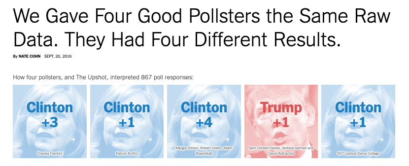


.pull-left[
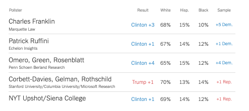

]

.pull-right[
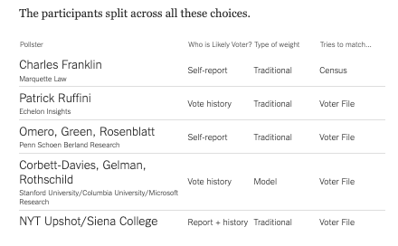
]

[New York Times](https://www.nytimes.com/interactive/2016/09/20/upshot/the-error-the-polling-world-rarely-talks-about.html)

---
## The Challenge of Election Polling

.pull-left[

- The population is unknown

- Response rates are low

- Response rates differ

- Adjustments are imperfect

]

.pull-right[


[Pew](https://www.pewresearch.org/fact-tank/2019/02/27/response-rates-in-telephone-surveys-have-resumed-their-decline/)
]


---
## Error and Bias


[Source](https://medium.com/@akgone38/what-the-heck-bias-variance-tradeoff-is-fe4681c0e71b)

---
## Polling Error

Total Survey Error in Election polling is a function of:

- Sampling Error

- Temporal Error

- Non-Sampling Error

---
## Polling Error

Total Survey Error (how far off a poll's estimate is from the truth) can be broken down into different parts:

- **Sampling Error:**
  - That error that arises from sampling from a population
  
  - Sample Size $\uparrow$ $\to$ Sampling error $\downarrow$
  
  - Margins of error typically only reflect sampling error

---
## Polling Error

Total Survey Error (how far off a poll's estimate is from the truth) can be broken down into different parts:

- Sampling Error:

- **Temporal Error:**

  - The error that comes from polling a dynamic race at specific point in time
  
  - Polls closer to the election $\to$ Temporal Error $\downarrow$


---
## Polling Error

Total Survey Error (how far off a poll's estimate is from the truth) can be broken down into different parts:

- Sampling Error:

- Temporal Error:

- **Non-sampling Error:**
  - Errors that arise from how a poll is implemented and analyzed
    - Coverage error: Sampling Frame $\neq$ Population
    - Response bias: Some people are more less likely to take a poll
    - Measurement bias: Question wording, order, can influence responses
    - Processing and adjustment error: Failing to weight for key demographics


---
## Election Polling: Example

---

<iframe title="Democratic Primary for RI Governor (August 2022)" aria-label="Split Bars" id="datawrapper-chart-65b9Y" src="https://datawrapper.dwcdn.net/65b9Y/5/" scrolling="no" frameborder="0" style="width: 0; min-width: 100% !important; border: none;" height="685"></iframe><script type="text/javascript">!function(){"use strict";window.addEventListener("message",(function(e){if(void 0!==e.data["datawrapper-height"]){var t=document.querySelectorAll("iframe");for(var a in e.data["datawrapper-height"])for(var r=0;r<t.length;r++){if(t[r].contentWindow===e.source)t[r].style.height=e.data["datawrapper-height"][a]+"px"}}}))}();</script>

---
## 12 News/Roger Williams University Poll – August 2022

- **Pollster:** Fleming & Associates
- **Sampling frame:** Probability Sample of Registered Voters
- **Sample size:** 405
- **Survey mode:** Live Caller with land and cell phone
- Survey Instrument: See cross tabs of the questions here [Questions](https://www.wpri.com/democratic-primary-poll-results-august/)
- **Survey weights:** None that I can tell
- **Likely Voter Model:** Hard to say, but based on past surveys probably two-part screener:
  - Are you registered to vote?
  - How likely are you to vote in the Democratic Primary?
- **Margin of Error:**

$$
\begin{align}
MoE &= \pm 4.9 \\
    &= 1.96 *\sqrt{((p*(1-p))/405)}\\
    &= 1.96 *\sqrt{((0.5*(1-0.5))/405)}\\
    &= \pm 4.869659
\end{align}
$$
---
## Evaluating a poll

.pull-left[
Two criteria

- Did they call the race correctly?
  - Yes! McKee won

- Did they get the margin right?
  - Not exactly...
  - McKee one by about 3% percentage points over Foulkes, not Gorbea
]
.pull-right[
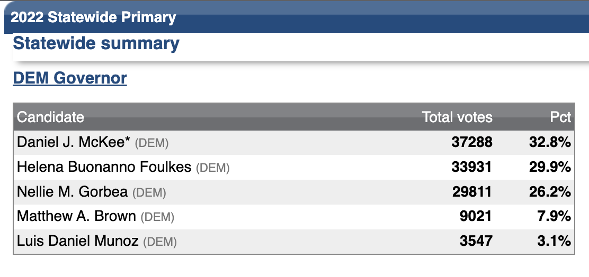
]

---
class: inverse, center, middle
# 💡
# Polls: How do we use them to forecast an election?

---
## Forecasting Elections

- Election forecasts reflect varying combinations of:

  - Expert Opinion
  - Fundamentals
  - Polling

- Forecasts differ in the extent to which they rely on these components and how they integrate them in their final predictions

---
## FiveThirtyEight's Approach to Forecasting

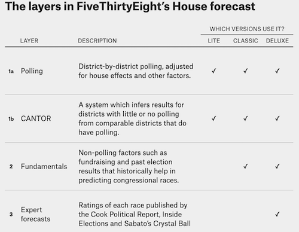

---
## Forecasting Elections

- The preeminence of polling in modern forecasts reflects the success of Nate Silver and FiveThirtyEight in correctly predicting the 2008 (49/50 states) 2012 (50/50) presidential elections 
  
  - Any one poll is likely to deviate from the true outcome
  
  - Averaging over multiple polls $\to$ more accurate predictions than any one poll, provided...

  - the polls aren't **systematically** biased

- The present concerns over polling the failure of such approaches to predict 
  
  - Trump's Victory in 2016
  
  - Strength of Trumps Support in 2020

  
---
class: inverse, center, middle
# 💡
# Polls: How have they done in the past?


---
class: inverse, top, middle
background-image: url("https://media.giphy.com/media/EZRgasxEGmtN6nycsB/giphy.gif")
background-size: fill
## Polling the 2016 Elections

  
---
## Polling the 2016 Election:

- The polls missed bigly
--
  - National polls were reasonably accurate (Clinton wins Popular Vote)
  - State polls overstated Clinton's lead / understated Trump support


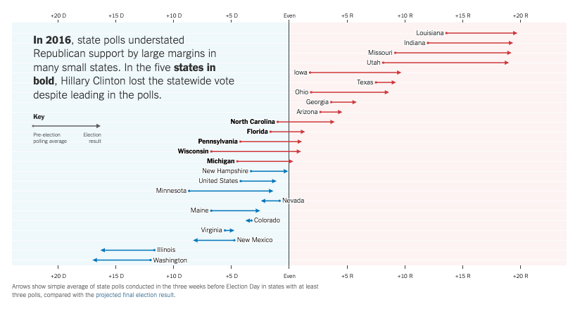

[New York Times](https://www.nytimes.com/interactive/2016/11/13/upshot/putting-the-polling-miss-of-2016-in-perspective.html)

---
## How did we get it so wrong in 2016?


Some likely explanations

- Likely voter models overstated Clinton's support

- Large number of undecided voters broke decisively for Trump

- White voters without a college underrepresented in pre-election surveys

A full autopsy from [AAPOR](https://www.aapor.org/Education-Resources/Reports/An-Evaluation-of-2016-Election-Polls-in-the-U-S.aspx)
[Image](https://www.nytimes.com/interactive/2016/upshot/presidential-polls-forecast.html?_r=0#other-forecasts)
---

.pull-left[
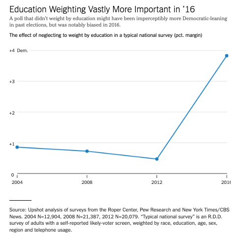
]

.pull-right[
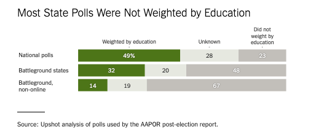
]

[New York Times](https://www.nytimes.com/2017/05/31/upshot/a-2016-review-why-key-state-polls-were-wrong-about-trump.html)

---
class: inverse, top, middle
background-image: url("https://media.giphy.com/media/H4KYT0ZKOXIxWnULsk/giphy.gif")
background-size: fill
## Polling the 2018 Elections


---
## 2018: A brief repreive?

- Polls did a better job
  - Most state polls weighted by education
  - Underestimated Dems in House and Gubernatorial race
  - No Partisan Bias in Senate Races
- Forecasts correctly call:
  - Democratic House
  - Republican Senate

However...

---

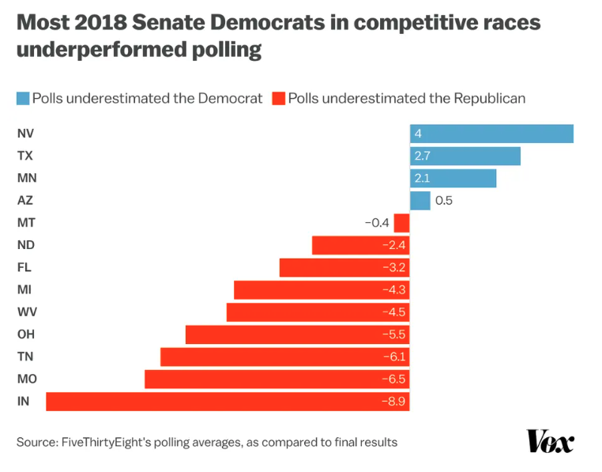

[Vox](https://www.vox.com/2022/9/23/23353634/polls-bias-democrats-midterms)

---
class: inverse, top, middle
## Polling the 2020 Elections

background-image:url("https://media.giphy.com/media/26FmQ3zBr4i0SqR0s/giphy.gif")
background-size:cover

---
## 2020: Historic Problems, Unclear Solutions

- Average polling errors for national popular vote were 4.5 percentage points -- **highest in 40 years**

- Polls overstated Biden's support by 3.9 points national polls (4.3 points in state polls)

- Polls overstated Democratic support in Senate and Guberatorial races by about 6 points

- [Forecasts predicted](https://projects.fivethirtyeight.com/2020-election-forecast/senate/) Democrats would hold 

  - 48-55 seats in the Senate (actual: 50)
  - 225-254 seats in the House (actual: 222)

---
## 2020: What when wrong

- Unlike, 2016, currently no clear explanation for why the polls missed

.pull-left[

**Not a cause:**

- Undecided voters
- Failing to weight for education
- Other demographic imbalances
- "Shy Trump Voters"
- Polling Early vs Election day voters

]

--
.pull-right[
**Potential Explanations**

- Covid-19
  - Democrats more likely to take polls
- Unit non-response
  - Between parties
  - Within parties
  - Across new and unaffiliated voters


]

[AAPOR Report](https://www.aapor.org/Education-Resources/Reports/2020-Pre-Election-Polling-An-Evaluation-of-the-202.aspx)
---
class: inverse, center, middle
# 💡
# Polls: What will they think of next?

---
## How will the polls do 2022 Elections

- What are the polls saying?

--

- Why they might be wrong

--

- Why they might be all right

--

- What do we think will influence the race more broadly

--

But first...

---

<iframe src="https://paul-testa.shinyapps.io/midterm_results/" style="border: 1px solid #AAA; width: 800px; height: 500px"></iframe>


---
## What are the Polls Saying

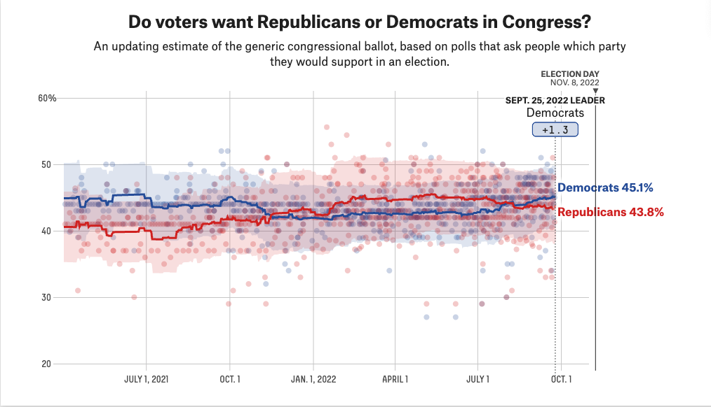

[FiveThirtyEight](https://projects.fivethirtyeight.com/polls/generic-ballot/)
---
## FiveThirtyEight 2022 Forecast

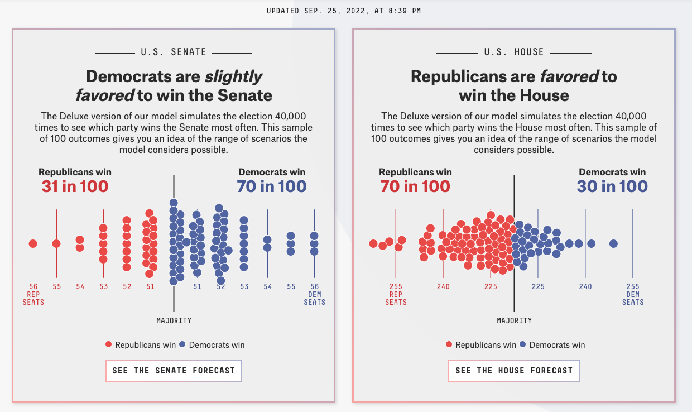
[FiveThirtyEight](https://projects.fivethirtyeight.com/2022-election-forecast/)

---
## FiveThirtyEight 2022 Forecast

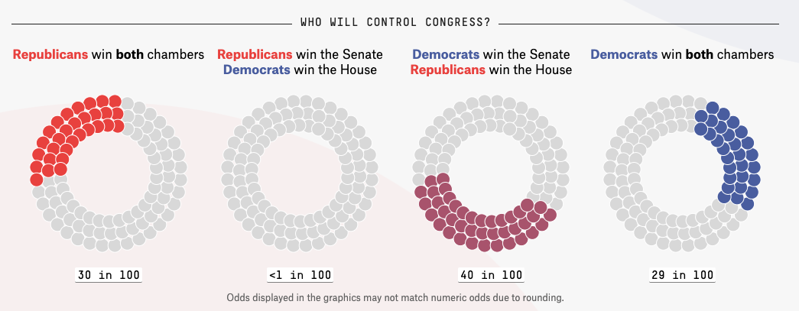
[FiveThirtyEight](https://projects.fivethirtyeight.com/2022-election-forecast/)

---
## Why the polls might be wrong

- After 2016, we had a reasonable idea of what went wrong, and how to fix it (e.g. weight for education)

- Lack a similar explanation for the polling errors of 2020.

- [AAPOR Report](https://www.aapor.org/Education-Resources/Reports/2020-Pre-Election-Polling-An-Evaluation-of-the-202.aspx) lays out three scenarios going forward. Problems in 2020: 
  - Persist in 2022 and beyond
  
  - Are Unique to Presidential Elections (Problem for 2024, but not 2022)
  
  - Unique to 2020/Covid/Trump (Not a prolbem )

---
## Why the polls might be wrong

.pull-left[

[Vox](https://www.vox.com/2022/9/23/23353634/polls-bias-democrats-midterms)
]

.pull-right[

[New York Times](https://www.nytimes.com/2022/09/12/upshot/polling-midterms-warning.html)
]

---
## Why the polls might be all right

Nate Silver makes the [counterargument](https://www.vox.com/2022/9/23/23353634/polls-bias-democrats-midterms)

.pull-left[

1. No historic bias
2. Pollsters incentives 
3. Forecasters update
4. No Trump
5. Accurate Special Elections
6. 2020 was unique
7. Small sample of elections.
]

.pull-right[
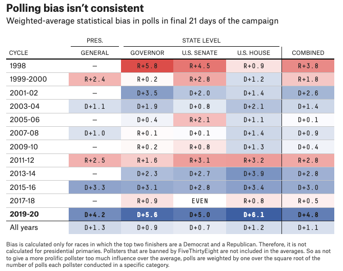
]

---
## Should we trust the polls to get it right this time?

--

- Ask me November 10

- Polling is hard, and getting harder
  - Fundamental Nonresponse challenges seem real
- Pollsters are innovative, and forecasts are flexible
- What's the alternative
  - Experts? 
  - Fundamentals?
- Will the polls get it right?

