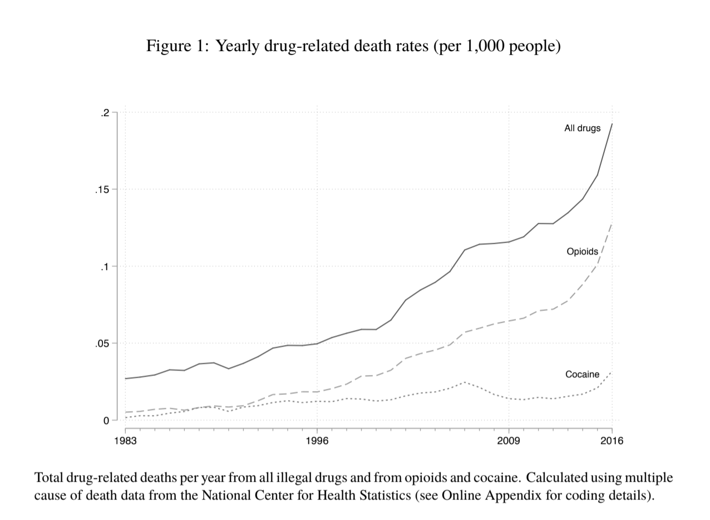
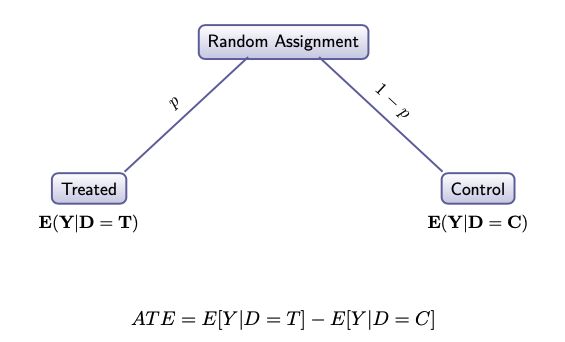
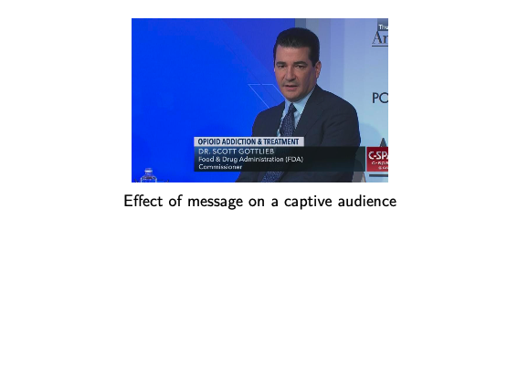
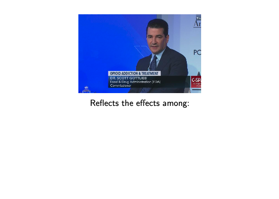
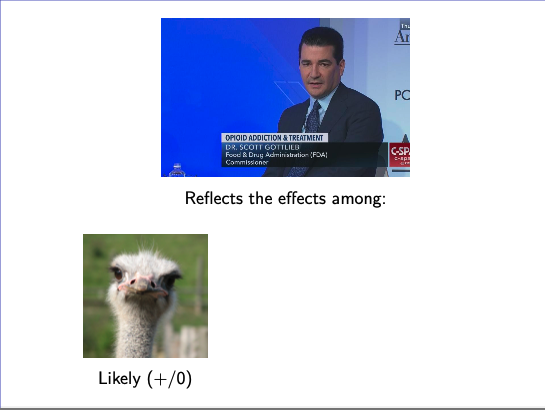
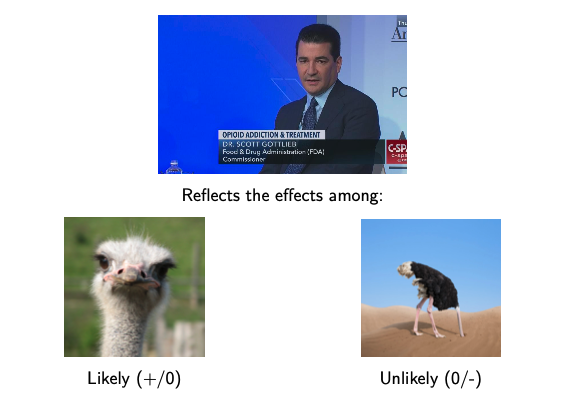
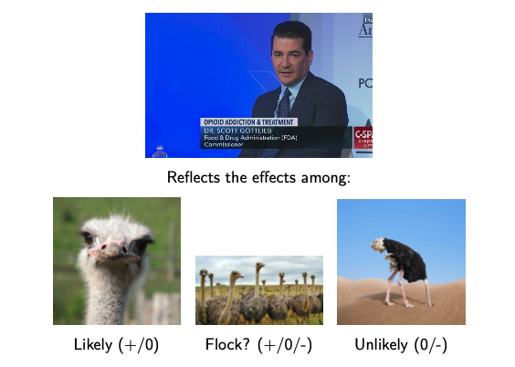
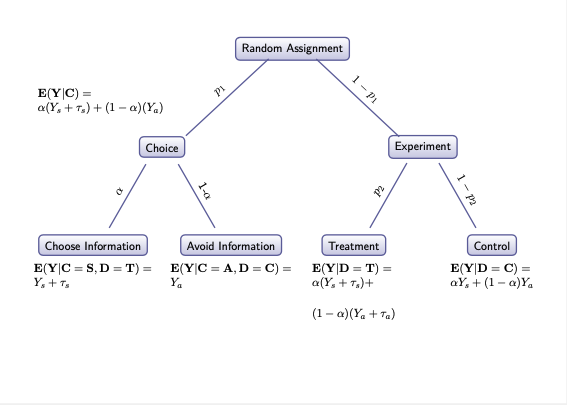
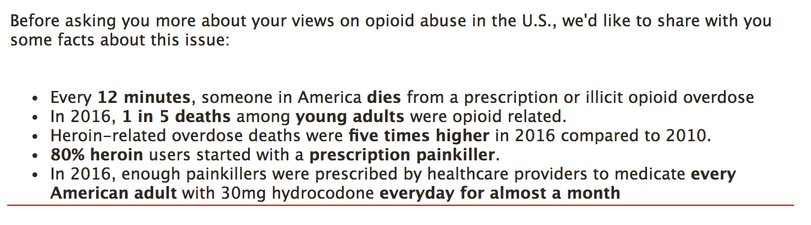
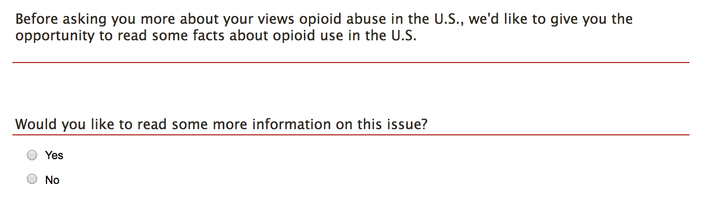

```{r setup, include=FALSE}
options(htmltools.dir.version = FALSE)
knitr::opts_chunk$set(warning = FALSE, message = FALSE, 
                      echo=F,
  comment = NA, dpi = 300,
  fig.align = "center", out.width = "60%", cache = FALSE)
library("tidyverse")
library("xaringanExtra")
library("forcats")

if (!require("pacman")){ install.packages("pacman") }
pacman::p_load("knitr","tidyverse","kableExtra",
               "reshape2","haven","readxl","janitor",
               "foreign","devtools","Hmisc",
               "texreg","stargazer","xtable","GGally",
               "broom","AER","car","arm","MASS",
               "lmtest","lme4","rstan",
               "ggrepel","patchwork"
               )

load("opioids.rda")

library(srvyr)
df_s <- df %>% as_survey_design(weights=weight)
# Load Data
source("functions.R")

```

```{r xaringan-tile-view, echo=FALSE}
xaringanExtra::use_tile_view()
```

# Overview

- "Flash" presentation of our paper by me

--

- Incisive comments by Susan

--

- Broader discussion by all of us


---
# Opioids are a problem in the U.S.


```{r}

```


---
# Opioids are a problem in the U.S.


```{r}
knitr::include_graphics("images/d2.jpg")
```


---
# Motivation

- Opioids are a problem in the U.S.

--

- Information has a role to play in addressing this problem

--

- Informing the public is hard

---
background-image:url("https://miro.medium.com/v2/resize:fit:1400/0*or3WjzJ_LYtsx33d")
background-size: contain

---
# Motivation

- Opioids are a problem in the U.S.


- Information has a role to play in addressing this problem


- Informing the public is hard

--

- Assessing the effects of these efforts can be challenging

---
# Goals

- Where do people receive information about the opioid crisis?

--

- What are the effects of attempts to inform the public about this crisis?

--

- How might these effects vary based on the likelihood of receiving this information?

---
# The Standard Approach: Do an Experiment!


```{r}

```

--

*The effect if everyone received the message*


---
# What we get from the standard approach

```{r}

```

---
# Is a weighted average of

```{r}

```

---
# The effects among a message's likely audience

```{r}

```

---
# And its unlikely audience

```{r}

```

---
# What we get versus what we want

```{r}

```

---
# Why we bring choice into our experimental design

- Why not just estimate effects in each group?

--

  - Sometimes we do! (CATEs)
  - Not always clear what's the relevant group

--

- Dangers of multiple comparisons, researcher degrees of freedom

--

- What we say $\neq$ what we do

--

Bringing choice into design and analysis of experiments helps address these problems and lets us ask new questions

---
# How we bring choice into our design 

```{r}

```

---
# What we get versus what we want

```{r}

```


---
# Treatment


```{r,out.width=700}

```

---
# Choice

```{r,out.width=700}

```

About 55 percent of the sample select into treatment

---
# Data

- Nationally representative survey fielded by YouGov (N=1,000) for the Taubman Institute in the Fall of 2018 

- The "median" respondent in our sample was a 47-year- old, white, woman with some college who identifies as being ideologically moderate and a political independent.

---
## Outcomes

- Self-reported sources of information (descriptive)

- Objective knowledge: "What percent of heroin users started with a prescription painkiller" (80 percent)

- Causal attributions: Over-prescription vs illicit drug use

- Two scales measuring support for more punitive and more treatment oriented responses to the opioid crisis


---
# Overview of Results

Where do people say they get information about opioids

--
  
- A variety of sources, in particular the media (> 70%)
  
--

Who chooses to receive additional information

--

- White, Liberal, college educated, people with personal experience

--

Did that information have an effect:

--

- Objective knowledge
- Causal attributions
- Policy beliefs


---

## Objective Knowledge

```{r}
know_df <- effects_fn(df, "dv_know_correct")
know_df1 <- know_df[c(1:4),] 
know_df1[2:4,1:7] <- NA
know_df2 <- know_df[c(1:4),] 
```

```{r}
ggplot(know_df1,aes(Estimate, Difference,col=Estimand))+
  geom_point(aes(shape=Estimand))+
  geom_linerange(aes(ymin=ll,ymax=ul),size=.3)+
  geom_linerange(aes(ymin=ll90,ymax=ul90),size=.6)+
  geom_hline(yintercept = 0,linetype="dashed")+
  theme(axis.text.x = element_text(
    angle = 0, hjust = 1),
    axis.text.y = element_text(face=ifelse(rev(know_df1$Estimate)%in%c("ATE","ACTE:","CATE:"),"bold","italic"),
                               size=ifelse(rev(know_df1$Estimate)%in%c("ATE","ACTE:","CATE:"),12,10)
    )
  ) + coord_flip()
```

---
## Objective Knowledge


```{r}
ggplot(know_df2,aes(Estimate, Difference,col=Estimand))+
  geom_point(aes(shape=Estimand))+
  geom_linerange(aes(ymin=ll,ymax=ul),size=.3)+
  geom_linerange(aes(ymin=ll90,ymax=ul90),size=.6)+
  geom_hline(yintercept = 0,linetype="dashed")+
  theme(axis.text.x = element_text(
    angle = 0, hjust = 1),
    axis.text.y = element_text(face=ifelse(rev(know_df1$Estimate)%in%c("ATE","ACTE:","CATE:"),"bold","italic"),
                               size=ifelse(rev(know_df1$Estimate)%in%c("ATE","ACTE:","CATE:"),12,10)
    )
  ) + coord_flip()
```

---
## Objective Knowledge

```{r}
plot_effects_fn(df,"dv_know_correct")

```


---
## Casual attributions: Over-prescription

```{r}
over_df <- effects_fn(df, "dv_cause_providers")
over_df1 <- over_df[c(1:4),] 
over_df1[2:4,1:7] <- NA
over_df2 <- over_df[c(1:4),] 
```

```{r}
ggplot(over_df1,aes(Estimate, Difference,col=Estimand))+
  geom_point(aes(shape=Estimand))+
  geom_linerange(aes(ymin=ll,ymax=ul),size=.3)+
  geom_linerange(aes(ymin=ll90,ymax=ul90),size=.6)+
  geom_hline(yintercept = 0,linetype="dashed")+
  theme(axis.text.x = element_text(
    angle = 0, hjust = 1),
    axis.text.y = element_text(face=ifelse(rev(over_df1$Estimate)%in%c("ATE","ACTE:","CATE:"),"bold","italic"),
                               size=ifelse(rev(over_df1$Estimate)%in%c("ATE","ACTE:","CATE:"),12,10)
    )
  ) + coord_flip()
  
```

---
## Casual attributions: Over-prescription


```{r}
ggplot(over_df2,aes(Estimate, Difference,col=Estimand))+
  geom_point(aes(shape=Estimand))+
  geom_linerange(aes(ymin=ll,ymax=ul),size=.3)+
  geom_linerange(aes(ymin=ll90,ymax=ul90),size=.6)+
  geom_hline(yintercept = 0,linetype="dashed")+
  theme(axis.text.x = element_text(
    angle = 0, hjust = 1),
    axis.text.y = element_text(face=ifelse(rev(over_df1$Estimate)%in%c("ATE","ACTE:","CATE:"),"bold","italic"),
                               size=ifelse(rev(over_df1$Estimate)%in%c("ATE","ACTE:","CATE:"),12,10)
    )
  ) + coord_flip()
```


---
## Casual attributions: Illicit drug use

```{r}
over_df <- effects_fn(df, "dv_cause_users")
over_df1 <- over_df[c(1:4),] 
over_df1[2:4,1:7] <- NA
over_df2 <- over_df[c(1:4),] 
```

```{r}
ggplot(over_df1,aes(Estimate, Difference,col=Estimand))+
  geom_point(aes(shape=Estimand))+
  geom_linerange(aes(ymin=ll,ymax=ul),size=.3)+
  geom_linerange(aes(ymin=ll90,ymax=ul90),size=.6)+
  geom_hline(yintercept = 0,linetype="dashed")+
  theme(axis.text.x = element_text(
    angle = 0, hjust = 1),
    axis.text.y = element_text(face=ifelse(rev(over_df1$Estimate)%in%c("ATE","ACTE:","CATE:"),"bold","italic"),
                               size=ifelse(rev(over_df1$Estimate)%in%c("ATE","ACTE:","CATE:"),12,10)
    )
  ) + coord_flip()
```

---
## Casual attributions: Illicit drug use


```{r}
ggplot(over_df2,aes(Estimate, Difference,col=Estimand))+
  geom_point(aes(shape=Estimand))+
  geom_linerange(aes(ymin=ll,ymax=ul),size=.3)+
  geom_linerange(aes(ymin=ll90,ymax=ul90),size=.6)+
  geom_hline(yintercept = 0,linetype="dashed")+
  theme(axis.text.x = element_text(
    angle = 0, hjust = 1),
    axis.text.y = element_text(face=ifelse(rev(over_df1$Estimate)%in%c("ATE","ACTE:","CATE:"),"bold","italic"),
                               size=ifelse(rev(over_df1$Estimate)%in%c("ATE","ACTE:","CATE:"),12,10)
    )
  ) + coord_flip()
```

---
## Policy Beliefs: Treatment Oriented Responses


```{r}
df$dv_pca_treatment <-  psych::principal(df  %>%
                                           dplyr::select("op_prop_1","op_prop_4",
                                                         "op_prop_5","op_prop_6","op_prop_7"
                                                         ), scores=T,missing=T)$scores[,1]
df$dv_pca_punitive <- psych::principal(df  %>%
                                         dplyr::select("op_prop_2","op_prop_3"), scores=T,missing=T)$scores[,1]

pun_df <- effects_fn(df, "dv_pca_punitive")
pun_df1 <- pun_df[c(1:4),] 
pun_df1[2:4,1:7] <- NA
pun_df2 <- pun_df[c(1:4),] 

treat_df <- effects_fn(df, "dv_pca_treatment")
treat_df1 <- treat_df[c(1:4),] 
treat_df1[2:4,1:7] <- NA
treat_df2 <- treat_df[c(1:4),] 

```


```{r}
ggplot(treat_df1,aes(Estimate, Difference,col=Estimand))+
  geom_point(aes(shape=Estimand))+
  geom_linerange(aes(ymin=ll,ymax=ul),size=.3)+
  geom_linerange(aes(ymin=ll90,ymax=ul90),size=.6)+
  geom_hline(yintercept = 0,linetype="dashed")+
  theme(axis.text.x = element_text(
    angle = 0, hjust = 1),
    axis.text.y = element_text(face=ifelse(rev(treat_df1$Estimate)%in%c("ATE","ACTE:","CATE:"),"bold","italic"),
                               size=ifelse(rev(treat_df1$Estimate)%in%c("ATE","ACTE:","CATE:"),12,10)
    )
  ) + coord_flip()
```

---
## Policy Beliefs: Treatment Oriented Responses


```{r}
ggplot(treat_df2,aes(Estimate, Difference,col=Estimand))+
  geom_point(aes(shape=Estimand))+
  geom_linerange(aes(ymin=ll,ymax=ul),size=.3)+
  geom_linerange(aes(ymin=ll90,ymax=ul90),size=.6)+
  geom_hline(yintercept = 0,linetype="dashed")+
  theme(axis.text.x = element_text(
    angle = 0, hjust = 1),
    axis.text.y = element_text(face=ifelse(rev(treat_df2$Estimate)%in%c("ATE","ACTE:","CATE:"),"bold","italic"),
                               size=ifelse(rev(treat_df2$Estimate)%in%c("ATE","ACTE:","CATE:"),12,10)
    )
  ) + coord_flip()
```

---
## Policy Beliefs: Punitive Responses


```{r}
ggplot(pun_df1,aes(Estimate, Difference,col=Estimand))+
  geom_point(aes(shape=Estimand))+
  geom_linerange(aes(ymin=ll,ymax=ul),size=.3)+
  geom_linerange(aes(ymin=ll90,ymax=ul90),size=.6)+
  geom_hline(yintercept = 0,linetype="dashed")+
  theme(axis.text.x = element_text(
    angle = 0, hjust = 1),
    axis.text.y = element_text(face=ifelse(rev(pun_df1$Estimate)%in%c("ATE","ACTE:","CATE:"),"bold","italic"),
                               size=ifelse(rev(pun_df1$Estimate)%in%c("ATE","ACTE:","CATE:"),12,10)
    )
  ) + coord_flip()
```

---
## Policy Beliefs: Punitive Responses


```{r}
ggplot(pun_df2,aes(Estimate, Difference,col=Estimand))+
  geom_point(aes(shape=Estimand))+
  geom_linerange(aes(ymin=ll,ymax=ul),size=.3)+
  geom_linerange(aes(ymin=ll90,ymax=ul90),size=.6)+
  geom_hline(yintercept = 0,linetype="dashed")+
  theme(axis.text.x = element_text(
    angle = 0, hjust = 1),
    axis.text.y = element_text(face=ifelse(rev(pun_df2$Estimate)%in%c("ATE","ACTE:","CATE:"),"bold","italic"),
                               size=ifelse(rev(pun_df2$Estimate)%in%c("ATE","ACTE:","CATE:"),12,10)
    )
  ) + coord_flip()
```


---
## Summary

- People receive information about the opioid crisis from a variety of sources

--

- The effects of information vary based on likelihood of receiving it
    - Likely recipients of information respond how we would hope: More likely to view the issue as public health problem in need of public health responses
    - Unlikely recipients are largely unmoved

--

- Incorporating choice into the design of our experiment key. 

--

- Future research could look at
  - Alternative treatments (randomized conditional on choice)
  - Alternative measures
  - Broader applications to other questions in political science and public health

---
class: inverse, center, middle


# Thank You

Paul Testa

<paul_testa@brown.edu>

<https://paultesta.org>

Brown University


---
# Reviewer Critiques

1. Threats to internal validity

2. Theoretical explanation for selective approach and avoidance

3. Alternative explanations for findings

4. Broader theoretical methodological implications

5. Persistence of the treatment effect
