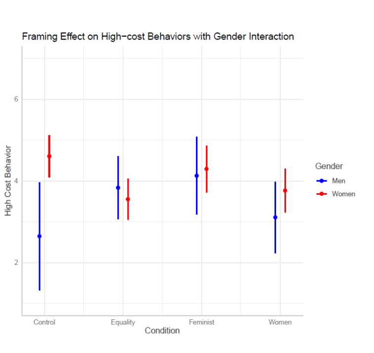
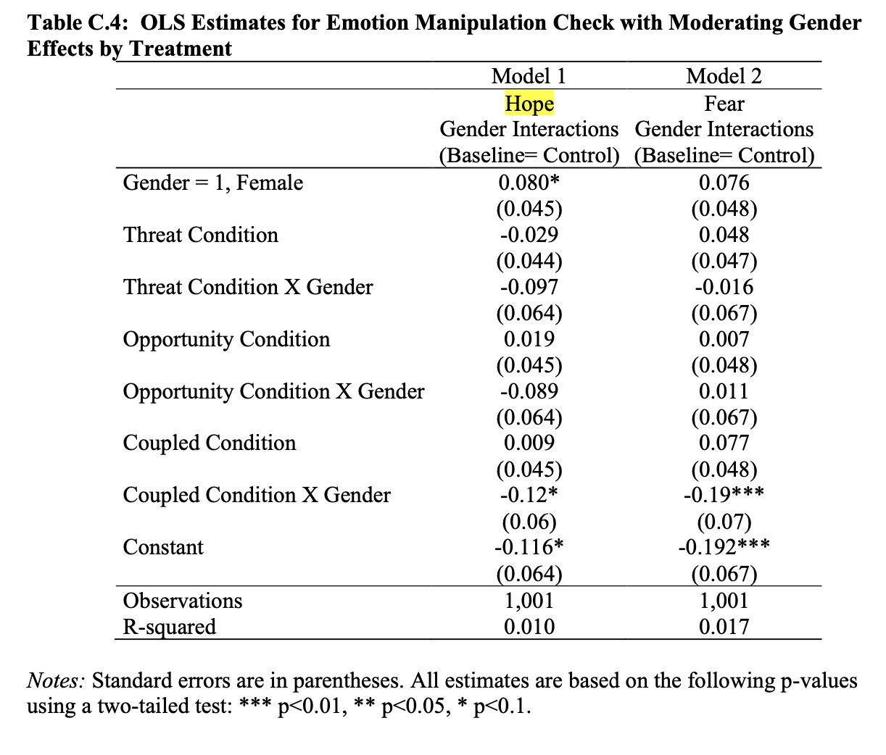
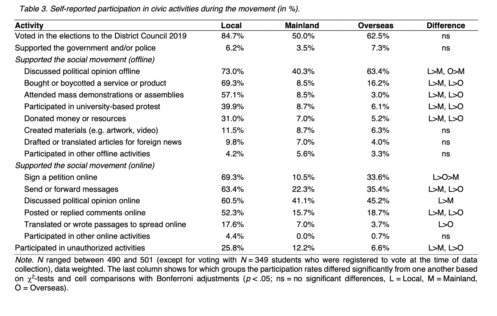

```{r setup, include=FALSE}
options(htmltools.dir.version = FALSE)
knitr::opts_chunk$set(warning = FALSE, message = FALSE, 
                      echo=F,
  comment = NA, dpi = 300,
  fig.align = "center", out.width = "60%", cache = FALSE)
library("tidyverse")
library("xaringanExtra")
library("anesr")
library("forcats")
```

# Overview

1. [Seoungin Choi](#paper1-slide)

2. [Vanessa Cruz Nichols](#paper2-slide)

3. [Frank Reichert](#paper3-slide)

4. [Javier Padilla](#paper4-slide)

5. [Morrey Liedke](#paper5-slide)


---
name: paper1-slide
class: middle, center

#  Seoungin Choi

### Effects of Broadness of Frames on Mobilization: Different Framing Effects on the #MeToo Movement

#### and

### Effects of the Gain and Loss Frame on Emotions and Participation in Immigrant Social Movements


---
## Summary: Broadness of Frames

- What kinds of frames are most effective

  - Broad 'Master' Frames vs More Narrow defined in terms of Social Identity

--

- Experimental design assessing effects of Equality > Women > Feminist frames about \#MeToo movement on "high" vs "low" cost outcomes


--

- More narrow frames appear more sucessful at mobilizing more high cost actions in support of \#MeToo (among men!)

---
## Comments

Reviewer 2 type critiques:

--

- Small, student sample 

  - More descriptives on characteristics
  - Replication and extension

--

- Are any of these outcomes really "high cost"

--

- Mostly Null or Negative ATEs
  - Are these just weak frames

--

- CATEs by gender suggest divergent responses from women

  - Really interesting potential tension between which frames mobilize which audiences and the potential tradeoffs
  - Can movements target different frames to different groups?
  

---

```{r}

```


---
## Questions

1. Does this replicate with different sample

--

2. Does this generalize to different issues?

--

3. What's the mechanism? 

---
## Gain-Loss Frames


- Clever to bring in self interest into gain-loss/risk aversion

--

- How to Measure vs Manipulate 

  - Emotion

  - Hypothetical vs actual self interest ([(White, Laird, and Allen, 2014)](https://www.cambridge.org/core/journals/american-political-science-review/article/selling-out-the-politics-of-navigating-conflicts-between-racial-group-interest-and-selfinterest/067DAC12A46715BAFAF1172F239AEA1F)

--

- Not convinced by these specific treatments 

---
name: paper2-slide
class: middle, center

# Vanessa Cruz Nichols
## Women at the Helm

---
## Summary

--
- What kinds of appeals -- threat, opporunity, or both -- mobilize action on immigration?

--

- Multi-arm experiment (threat, opportunity, threat + opp, control)


--

- Threat can mobilize action (among women, demobilize among men?), but threat + opportunity appears to be even more mobilizing

---
## Comments

Clever, clear design


--

Presentational suggestions:

- ATEs -> gender CATEs (Table C5) -> differnece in CATEs (Table 4.1)


- Theory before results?

--

What's the mechanism?

- Ways to further unpack socialization argument? 
  - Heterogeneous effects by age/generation
  - What's up with men?

- Mediation analyses of emotional response?

- Incorporate discussions of threat/opportunity/emotion into structured interviews?

--

- Is the mechanism really emotion? (Table C4)


---

```{r}

```

---
name: paper3-slide
class: middle, center

#  Frank Reichert et al.

## Youth on the Sidelines?


---
## Summary

- What explains non-participation in social protests

- Analysis of survey data and structured interviews from Students in Hong Kong in 2020

- The dynamics of non-participation (non-conversion & erosion) are distinct from participation
  - Structural barriers and deterrents
  - Lack of movement identities, weak informal networks, and growth of more hostile actions/framings -> non-participation

---

```{r}

```

  
---
## Comments


- Beautiful descriptive analyses

--


- Is participation: 
  - Binary (Participant Non-participant)
  - Continuous (degrees of participation)
  - Categorical measures (participant types)

--

- Movement support is not static but it's hard to capture these dynamics 
  - Possible to link responses from baseline March 2019 survey
  - Non students?

--

- Whither internal efficacy?

--

- How do we adjudicate the relative impact of different factors?
  - Material vs Ideational concerns?
  - What's the causal DAG?
  
--

- How unique are these dynamics to place and time?

--

- What's the equilibirium? How should movement activists think about/weigh these potential tradeoffs?
  - Digital vs traditional networks?

---
name: paper4-slide
class: middle, center

#  Javier Padilla

## Do Protests Change Citizens’ Perceptions of Political Parties?
### Evidence from the 15-M in Spain

---
## Summary

- Does participation in social protest change political attiudes


--

- Leverage an "Unexpected Event During Survey Design" to compare the attitudes of participants in the 15-M surveyed before May 15, to those surveyed after

--

- Credible evidence that participants in the protest came to see the PSOE as less liberal (more centrist)


---
## Comments


- Clever design, carefully executed, compelling results

  - Why relegate vote choice to the appendix?

--

Further leverage from:

- Alternative DVs:
  - Within subject, change scores
  - Summary of perceived ideology/polarization of party system
  - Scores for the PP (other parties)
  - Measures of populism
- Alternative Samples:
  - Non leftists (Right/Moderates)
  
--

Broader questions

- Do the results really address populist dimension vs empty space claims?
- What's the mechanism?
- Generalizability to different contexts/issues?

---
name: paper5-slide
class: middle, center

#  Morrey Liedke

## From Conciousness to Action:
### Mutliple Minorities and Political Engagement

---
## Summary

- Does high feminist group consciousness translate into political action?

  - Does prior experiences with other forms of discrimination contribute to this identity 

- Synthesize competing expectations for the origins and consequences of gendered/feminist identity

- Replicate and extend [Harnois (2015)](https://psycnet.apa.org/record/2015-53801-005) incorporating new variables and measurements with additional survey experiments

---
## Comments

- Really wonderful attention to the complex, intersectional nature of identity and positionality
  
  - Your contributions are bigger than just a replication and extension

--

- What's the direction of casuality? Hard to unpack with cross sectional data

--

- What's the ideal experiment? 
  - How does feminist identity matter? 
  - When does feminist identity matter?
  - For whom does feminist identity matter?
  - Why does feminist identity matter?

--

- Potential natural experiments with *Dobbs* other unexpected events

--

- Is their a single/common shared conception feminist group conciousness?
  - Consistent or contextual


--

- Differences in perceived discrimination (1-1 and 4-4 are both ) vs Perceiving discrimination is greater for women vs men?

---


```{r}
data("timeseries_2020")
df <- timeseries_2020


df %>% 
  mutate(
    sexuality = case_when(
      V201601 > 0 ~ as_factor(V201601),
      T ~ NA_character_
    ),
    sex = case_when(
      V201600 > 0 ~ as_factor(V201600),
      T ~ NA_character_
    ), 
    discrim_women = case_when(
      V202532 < 0 ~ NA_real_,
      V202532 > 0 ~ (V202532-5)*-1
      ),
    discrim_men = case_when(
      V202533 < 0 ~ NA_real_,
      V202533 > 0 ~ (V202533-5)*-1
    ),
    diff = discrim_women - discrim_men
  ) -> df

df %>% 
  ggplot(aes(discrim_men,discrim_women, col = diff))+
  geom_jitter()+
  scale_color_gradient2()
```


---

```{r}
df %>%
  filter(!is.na(sexuality)) %>% 
  filter(!is.na(sex)) %>% 
  ggplot(aes(sexuality, discrim_women, col = sex))+
  stat_summary()+
  coord_flip()
```

